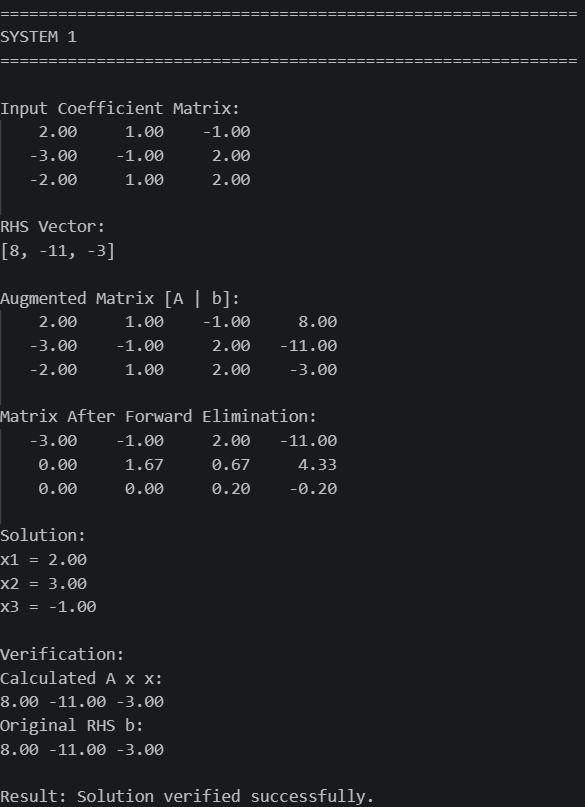
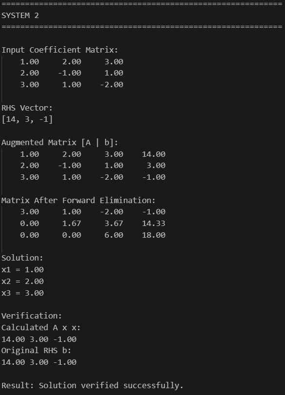
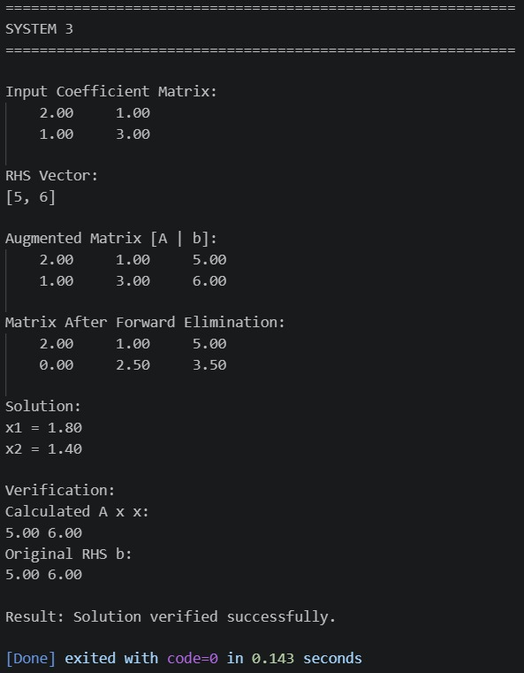

# Implementation of Gaussian Elimination Algorithm for Solving Linear Systems

## Project Title

#### **Implementation of Gaussian Elimination Algorithm for Solving Linear Systems**

## Objective

The objective of this project is to develop a generalized Python program for solving systems of linear equations using the **Gaussian Elimination algorithm**.

The program accepts a coefficient matrix and a right-hand-side (RHS) vector, forms the augmented matrix, converts it into upper triangular form using elementary row operations, and obtains the solution using back substitution.

The program also implements **partial pivoting** to handle zero or very small pivot elements and includes verification and error handling.

## Introduction

A system of linear equations consists of two or more equations involving unknown variables. Such systems occur frequently in mathematics, engineering, computer science, statistics, and numerical computing.

A system of `n` linear equations can be represented in matrix form as:

\[
AX=B
\]

where:

- `A` is the coefficient matrix.
- `X` is the vector of unknown variables.
- `B` is the RHS vector.

Gaussian Elimination is a numerical method that transforms the system into an equivalent upper triangular system. The unknown variables can then be obtained through a process called **back substitution**.

In this project, the algorithm is implemented using Python functions so that it can be used for general square matrices rather than only for a specific example.

# ==================
# Algorithm
# ==================

1. Read the coefficient matrix `A`.
2. Read the RHS vector `B`.
3. Validate the dimensions of `A` and `B`.
4. Create the augmented matrix `[A|B]`.
5. Select the pivot element.
6. Apply partial pivoting.
7. Swap rows if necessary.
8. Eliminate elements below the pivot.
9. Repeat the process for all pivot positions.
10. Check for singular or inconsistent systems.
11. Pass the upper triangular matrix to the back-substitution function.
12. Calculate the unknown variables.
13. Substitute the solution into the original equations.
14. Verify the solution.


# ==================
# Psudocode
# ==================

FUNCTION gaussian_elimination(A, b):

    Validate A
    Validate b

    Create augmented matrix [A | b]

    FOR each pivot column i:

        Find row with maximum absolute value
        in column i from rows i to n-1

        IF pivot is zero:
            Report singular or non-unique system

        Swap current row with pivot row

        FOR each row j below row i:

            Calculate elimination factor

            FOR each column k:
                Update augmented[j][k]

    Return upper triangular matrix


FUNCTION back_substitution(U):

    Create solution vector x

    FOR i from n-1 down to 0:

        Calculate sum of known terms

        IF diagonal element is zero:
            Report zero pivot

        Calculate x[i]

    RETURN x


FUNCTION verify_solution(A, b, x):

    Calculate A × x

    Compare A × x with b

    IF values match:
        Return verified
    ELSE:
        Return verification failed


MAIN:

    Define first system

    Display input

    Call gaussian_elimination()

    Display augmented matrix

    Display matrix after elimination

    Call back_substitution()

    Display solution

    Verify solution


    Define second system

    Repeat above steps

# ==================
# Source code
# ==================

```python
import math

# ---------------------------------------------------------
# FUNCTION TO PRINT A MATRIX
# ---------------------------------------------------------

def print_matrix(matrix, title="Matrix"):

    print("\n" + title + ":")

    for row in matrix:
        for value in row:
            print(f"{value:8.2f}", end=" ")
        print()


# ---------------------------------------------------------
# FUNCTION TO VALIDATE INPUT
# ---------------------------------------------------------

def validate_input(A, b):

    # Check if matrix is empty
    if len(A) == 0:
        raise ValueError("Coefficient matrix cannot be empty.")

    n = len(A)

    # Check if matrix is square
    for row in A:
        if len(row) != n:
            raise ValueError(
                "Coefficient matrix must be square."
            )

    # Check RHS size
    if len(b) != n:
        raise ValueError(
            "RHS vector size must match matrix size."
        )


# ---------------------------------------------------------
# FUNCTION TO CREATE AUGMENTED MATRIX
# ---------------------------------------------------------

def create_augmented_matrix(A, b):

    augmented = []

    for i in range(len(A)):

        row = []

        # Add elements of A
        for j in range(len(A[i])):
            row.append(float(A[i][j]))

        # Add RHS value
        row.append(float(b[i]))

        augmented.append(row)

    return augmented


# ---------------------------------------------------------
# GAUSSIAN ELIMINATION
# WITH PARTIAL PIVOTING
# ---------------------------------------------------------

def gaussian_elimination(A, b):

    tolerance = 1e-10

    # Validate input
    validate_input(A, b)

    # Create augmented matrix
    augmented = create_augmented_matrix(A, b)

    n = len(A)

    # Go through each column
    for i in range(n):

        # -------------------------------------------------
        # FIND THE BEST PIVOT
        # -------------------------------------------------

        pivot_row = i

        for j in range(i + 1, n):

            if abs(augmented[j][i]) > abs(augmented[pivot_row][i]):
                pivot_row = j

        # Check if pivot is zero
        if abs(augmented[pivot_row][i]) < tolerance:
            continue

        # -------------------------------------------------
        # SWAP ROWS
        # -------------------------------------------------

        if pivot_row != i:

            temp = augmented[i]
            augmented[i] = augmented[pivot_row]
            augmented[pivot_row] = temp

        # -------------------------------------------------
        # ELIMINATION
        # -------------------------------------------------

        for j in range(i + 1, n):

            # If value is already zero, skip
            if abs(augmented[j][i]) < tolerance:
                augmented[j][i] = 0
                continue

            # Calculate elimination factor
            factor = augmented[j][i] / augmented[i][i]

            # Subtract pivot row
            for k in range(i, n + 1):

                augmented[j][k] = (
                    augmented[j][k]
                    - factor * augmented[i][k]
                )

            # Remove very small floating-point errors
            if abs(augmented[j][i]) < tolerance:
                augmented[j][i] = 0

    # -----------------------------------------------------
    # CHECK FOR SINGULAR / INCONSISTENT SYSTEM
    # -----------------------------------------------------

    for i in range(n):

        all_zero = True

        for j in range(n):

            if abs(augmented[i][j]) >= tolerance:
                all_zero = False
                break

        # Example:
        # 0 0 0 | 5
        # means no solution

        if all_zero and abs(augmented[i][n]) >= tolerance:
            raise ValueError(
                "System is inconsistent and has no solution."
            )

        # Example:
        # 0 0 0 | 0
        # means infinitely many solutions

        if all_zero and abs(augmented[i][n]) < tolerance:
            raise ValueError(
                "System does not have a unique solution."
            )

    return augmented


# ---------------------------------------------------------
# BACK SUBSTITUTION
# ---------------------------------------------------------

def back_substitution(upper_matrix):

    tolerance = 1e-10

    n = len(upper_matrix)

    # Create solution array
    x = []

    for i in range(n):
        x.append(0.0)

    # Start from last equation
    for i in range(n - 1, -1, -1):

        # Get pivot
        pivot = upper_matrix[i][i]

        # Check for zero pivot
        if abs(pivot) < tolerance:
            raise ValueError(
                "Zero pivot encountered during back substitution."
            )

        # Start with RHS value
        sum_value = upper_matrix[i][n]

        # Subtract already known values
        for j in range(i + 1, n):

            sum_value = (
                sum_value
                - upper_matrix[i][j] * x[j]
            )

        # Calculate unknown
        x[i] = sum_value / pivot

    return x


# ---------------------------------------------------------
# VERIFY SOLUTION
# ---------------------------------------------------------

def verify_solution(A, b, x):

    tolerance = 1e-8

    calculated = []

    # Calculate A × x
    for i in range(len(A)):

        value = 0

        for j in range(len(x)):

            value = value + A[i][j] * x[j]

        calculated.append(value)

    # Compare calculated values with b
    verified = True

    for i in range(len(b)):

        if abs(calculated[i] - b[i]) > tolerance:
            verified = False
            break

    return verified, calculated


# ---------------------------------------------------------
# COMPLETE SOLVER
# ---------------------------------------------------------

def solve_system(A, b):

    print_matrix(
        A,
        "Input Coefficient Matrix"
    )

    print("\nRHS Vector:")
    print(b)

    # Create and display augmented matrix
    augmented = create_augmented_matrix(A, b)

    print_matrix(
        augmented,
        "Augmented Matrix [A | b]"
    )

    # Gaussian elimination
    upper_matrix = gaussian_elimination(A, b)

    print_matrix(
        upper_matrix,
        "Matrix After Forward Elimination"
    )

    # Back substitution
    solution = back_substitution(upper_matrix)

    print("\nSolution:")

    for i in range(len(solution)):

        print(
            "x" + str(i + 1) + " = "
            + f"{solution[i]:.2f}"
        )

    # Verification
    verified, calculated = verify_solution(
        A,
        b,
        solution
    )

    print("\nVerification:")

    print("Calculated A x x:")

    for value in calculated:
        print(f"{value:.2f}", end=" ")

    print("\nOriginal RHS b:")

    for value in b:
        print(f"{value:.2f}", end=" ")

    print()

    if verified:
        print("\nResult: Solution verified successfully.")
    else:
        print("\nResult: Verification failed.")

    return solution


# =========================================================
# TEST SYSTEM 1
# =========================================================

A1 = [
    [2, 1, -1],
    [-3, -1, 2],
    [-2, 1, 2]
]

b1 = [8, -11, -3]

print("\n" + "=" * 60)
print("SYSTEM 1")
print("=" * 60)

try:

    solution1 = solve_system(A1, b1)

except ValueError as error:

    print("Error:", error)


# =========================================================
# TEST SYSTEM 2
# =========================================================

A2 = [
    [1, 2, 3],
    [2, -1, 1],
    [3, 1, -2]
]

b2 = [14, 3, -1]

print("\n" + "=" * 60)
print("SYSTEM 2")
print("=" * 60)

try:

    solution2 = solve_system(A2, b2)

except ValueError as error:

    print("Error:", error)


# =========================================================
# TEST SYSTEM 3
# =========================================================

A3 = [
    [2, 1],
    [1, 3]
]

b3 = [5, 6]

print("\n" + "=" * 60)
print("SYSTEM 3")
print("=" * 60)

try:

    solution3 = solve_system(A3, b3)

except ValueError as error:

    print("Error:", error)
```

# ==================
# Mathematical Concept
# ==================

Consider the following system:

\[
a_{11}x_1+a_{12}x_2+\cdots+a_{1n}x_n=b_1
\]

\[
a_{21}x_1+a_{22}x_2+\cdots+a_{2n}x_n=b_2
\]

\[
\vdots
\]

\[
a_{n1}x_1+a_{n2}x_2+\cdots+a_{nn}x_n=b_n
\]

This can be written as:

\[
AX=B
\]

For example:

\[
\begin{aligned}
2x+y-z&=8\\
-3x-y+2z&=-11\\
-2x+y+2z&=-3
\end{aligned}
\]

The coefficient matrix is:

\[
A=
\begin{bmatrix}
2&1&-1\\
-3&-1&2\\
-2&1&2
\end{bmatrix}
\]

and the RHS vector is:

\[
B=
\begin{bmatrix}
8\\
-11\\
-3
\end{bmatrix}
\]

## Augmented Matrix

The coefficient matrix and RHS vector are combined to form the augmented matrix:

\[
[A|B]
\]

For the above system:

\[
\left[
\begin{array}{ccc|c}
2&1&-1&8\\
-3&-1&2&-11\\
-2&1&2&-3
\end{array}
\right]
\]

Gaussian Elimination applies elementary row operations to convert this matrix into upper triangular form.

## Elementary Row Operations

The following row operations are used:

### Row interchange

\[
R_i \leftrightarrow R_j
\]

Two rows are exchanged.

### Row multiplication

\[
R_i \rightarrow kR_i
\]

A row is multiplied by a non-zero constant.

### Row replacement

\[
R_i \rightarrow R_i-kR_j
\]

A multiple of one row is subtracted from another row.

These operations preserve the solution of the system.

## Partial Pivoting

Partial pivoting is used to handle zero or very small pivot elements.

At every elimination step, the program examines the values below the current pivot and selects the row containing the largest absolute value.

That row is then exchanged with the current row.

For example:

\[
\begin{bmatrix}
0&2&1\\
1&-1&2\\
2&1&-1
\end{bmatrix}
\]

The first pivot is zero. Therefore, the program searches the rows below it and swaps in a suitable row before continuing elimination.

This improves the numerical stability of the algorithm.

## Forward Elimination

Forward elimination converts the augmented matrix into upper triangular form.

The general form after elimination is:

\[
\left[
\begin{array}{cccc|c}
u_{11}&u_{12}&u_{13}&\cdots&c_1\\
0&u_{22}&u_{23}&\cdots&c_2\\
0&0&u_{33}&\cdots&c_3\\
\vdots&\vdots&\vdots&\ddots&\vdots\\
0&0&0&\cdots&u_{nn}&c_n
\end{array}
\right]
\]

Once this form is obtained, the variables can be calculated starting from the last equation.

## Back Substitution

Back substitution is implemented as a separate function.

For the last equation:

\[
u_{nn}x_n=c_n
\]

therefore:

\[
x_n=\frac{c_n}{u_{nn}}
\]

The value of \(x_n\) is then substituted into the previous equation to calculate \(x_{n-1}\).

The process continues until all unknowns are obtained.

The general formula is:

\[
x_i=
\frac{
c_i-\sum_{j=i+1}^{n}u_{ij}x_j
}{
u_{ii}
}
\]
# ==================
# Program Structure
# ==================

| Function | Purpose |
|---|---|
| `print_matrix()` | Displays matrices |
| `validate_input()` | Checks matrix dimensions |
| `create_augmented_matrix()` | Creates `[A|B]` |
| `gaussian_elimination()` | Performs elimination and pivoting |
| `back_substitution()` | Calculates the solution |
| `verify_solution()` | Verifies `AX=B` |
| `solve_system()` | Combines the complete process |

This modular approach makes the program reusable for different systems.

# ==================
# Test cases
# ==================

## Test Case 1

The first system used for testing is:

\[
2x+y-z=8
\]

\[
-3x-y+2z=-11
\]

\[
-2x+y+2z=-3
\]

### Input Matrix

\[
A=
\begin{bmatrix}
2&1&-1\\
-3&-1&2\\
-2&1&2
\end{bmatrix}
\]

### RHS

\[
B=
\begin{bmatrix}
8\\
-11\\
-3
\end{bmatrix}
\]

### Obtained Solution

\[
\boxed{x=2,\quad y=3,\quad z=-1}
\]

### Verification

First equation:

\[
2(2)+3-(-1)=8
\]

Second equation:

\[
-3(2)-3+2(-1)=-11
\]

Third equation:

\[
-2(2)+3+2(-1)=-3
\]

Therefore:

\[
AX=B
\]

and the solution is verified successfully.

## Test Case 2

The second system is:

\[
x+2y+3z=14
\]

\[
2x-y+z=3
\]

\[
3x+y-2z=-1
\]

The coefficient matrix is:

\[
A=
\begin{bmatrix}
1&2&3\\
2&-1&1\\
3&1&-2
\end{bmatrix}
\]

and:

\[
B=
\begin{bmatrix}
14\\
3\\
-1
\end{bmatrix}
\]

### Solution

\[
\boxed{x=1,\quad y=2,\quad z=3}
\]

### Verification

\[
1+2(2)+3(3)=14
\]

\[
2(1)-2+3=3
\]

\[
3(1)+2-2(3)=-1
\]

Therefore:

\[
\boxed{AX=B}
\]

and the solution is verified.
# ==================
# Additional Partial Pivoting Test
# ==================
To demonstrate partial pivoting, the following system can be used:

\[
2y+z=4
\]

\[
x-y+2z=-1
\]

\[
2x+y-z=4
\]

with:

\[
A=
\begin{bmatrix}
0&2&1\\
1&-1&2\\
2&1&-1
\end{bmatrix}
\]

and:

\[
B=
\begin{bmatrix}
4\\
-1\\
4
\end{bmatrix}
\]

The solution is:

\[
\boxed{x=1,\quad y=2,\quad z=0}
\]

The first pivot is zero, so the program must exchange rows before performing elimination. This demonstrates the partial pivoting feature.

# ==================
# Error Handling
# ==================
The program includes error handling for the following conditions:

### Invalid matrix dimensions

The program checks whether the coefficient matrix is square and whether the RHS vector has the correct number of elements.

### Zero pivot

A tolerance value is used to detect zero or extremely small pivot values.

### Singular system

If the elimination produces a row such as:

\[
[0\quad0\quad0|0]
\]

the system does not have a unique solution.

### Inconsistent system

If a row becomes:

\[
[0\quad0\quad0|c]
\]

where \(c\neq0\), the system has no solution.

## Verification

The program verifies the calculated solution by computing:

\[
AX
\]

and comparing the result with the original RHS vector:

\[
B
\]

Because floating-point calculations can produce very small numerical errors, a tolerance is used:

\[
|Calculated-B|<10^{-8}
\]

If this condition is satisfied for every equation, the solution is considered verified.
# ==================
# Results and Observations
# ==================
The implemented Gaussian Elimination algorithm successfully solves different systems of linear equations.

The program successfully performs:

- Augmented matrix formation.
- Partial pivoting.
- Forward elimination.
- Upper triangular matrix formation.
- Back substitution.
- Solution verification.
- Error detection.

The use of separate functions makes the implementation modular and allows the same program to solve systems of different sizes.

The partial pivoting test also demonstrates that the program can handle a zero pivot by exchanging rows.

# ==================
# Output
# ==================





# ==================
# Learning Outcomes
# ==================
After completing this project, the following concepts were understood and implemented:

- Gaussian Elimination.
- Matrix representation of linear systems.
- Elementary row operations.
- Forward elimination.
- Partial pivoting.
- Back substitution.
- Numerical solution of linear systems.
- Verification of calculated solutions.
- Error handling.
- Generalized numerical programming.
# ==================
# Conclusion
# ==================
The project successfully implements the Gaussian Elimination algorithm using Python.

The program is generalized and modular and can solve different square systems of linear equations. It forms an augmented matrix, performs forward elimination with partial pivoting, obtains the solution using back substitution, and verifies the result against the original system.

The project provides practical understanding of how a mathematical numerical algorithm can be converted into a reusable computational program.
