# **Implementation of Principal Component Analysis (PCA) Using Singular Value Decomposition (SVD)**

## Project Title

#### **Implementation and Application of Principal Component Analysis (PCA) Using Singular Value Decomposition (SVD)**

## Objective

The objective of this project is to understand and implement the
mathematical concepts of **Singular Value Decomposition (SVD)** and
**Principal Component Analysis (PCA)** using Python.

The program uses the **Iris dataset** and performs the main mathematical
steps manually. It calculates the mean of each feature, centers the
data, calculates the covariance matrix, finds eigenvalues and
eigenvectors, obtains singular values, constructs the SVD matrices,
performs dimensionality reduction, reconstructs the data, and calculates
reconstruction error.

The project also compares the reconstruction error for different numbers
of principal components.

## Introduction

Principal Component Analysis (PCA) is a dimensionality-reduction
technique used to represent a dataset using a smaller number of
variables while retaining as much of the important information as
possible.

The Iris dataset contains four features:

-   Sepal Length
-   Sepal Width
-   Petal Length
-   Petal Width

Therefore, every Iris sample initially exists in a **4-dimensional
feature space**.

PCA can reduce this 4-dimensional data to 2 dimensions while retaining
most of the variation in the dataset.

Singular Value Decomposition (SVD) is a matrix factorization technique
represented as:

\[ A=U`\Sigma `{=tex}V\^T \]

where:

-   `U` contains the left singular vectors.
-   `Σ` contains the singular values.
-   `V^T` contains the right singular vectors.

In this project, SVD is connected to PCA through the eigenvalues and
eigenvectors of the covariance matrix.

<div style="page-break-after: always;"></div>

# Algorithm


1.  Load the Iris dataset.
2.  Store the feature matrix `X`.
3.  Calculate the mean of every feature.
4.  Center the dataset by subtracting the mean from every row.
5.  Calculate the covariance matrix.
6.  Find the eigenvalues and eigenvectors of the covariance matrix.
7.  Sort the eigenvalues and corresponding eigenvectors in descending
    order.
8.  Calculate the singular values from the eigenvalues.
9.  Construct the matrix `V` and `V^T`.
10. Construct the diagonal singular-value matrix `S`.
11. Calculate the matrix `U`.
12. Verify the SVD reconstruction using `U × S × V^T`.
13. Calculate the explained variance ratio.
14. Select the first two principal components.
15. Project the centered data onto the first two components.
16. Reconstruct the original data using the selected components.
17. Calculate the reconstruction error.
18. Compare reconstruction errors for 1, 2, 3, and 4 components.
19. Plot the reduced 2-dimensional Iris dataset.

<div style="page-break-after: always;"></div>

# Pseudocode


FUNCTION load_dataset():

    Load Iris dataset

    Return feature matrix X

FUNCTION calculate_mean(X):

    Calculate mean of every column

    Return mean vector

FUNCTION center_data(X, mean):

    Subtract mean from every row

    Return centered matrix

FUNCTION calculate_covariance(X):

    Calculate:

        covariance = X^T × X / (n - 1)

    Return covariance matrix

FUNCTION calculate_eigen(covariance):

    Find eigenvalues and eigenvectors

    Sort them from largest to smallest

    Return eigenvalues and eigenvectors

FUNCTION calculate_svd(X, eigenvalues, eigenvectors):

    Calculate singular values

    Construct V and V^T

    Construct diagonal matrix S

    Calculate U

    Return U, S, V^T

FUNCTION reduce_data(X, V, k):

    Select first k principal components

    Project X onto selected components

    Return reduced data

FUNCTION reconstruct_data(reduced, components, mean):

    Project reduced data back to original space

    Add mean

    Return reconstructed data

FUNCTION calculate_error(original, reconstructed):

    Calculate mean squared reconstruction error

    Return error

MAIN:

    Load Iris dataset

    Calculate mean

    Center data

    Calculate covariance matrix

    Calculate eigenvalues and eigenvectors

    Calculate singular values

    Construct U, S and V^T

    Verify SVD

    Calculate explained variance

    Select first two principal components

    Reduce 4D data to 2D

    Reconstruct the data

    Calculate reconstruction error

    Compare different numbers of components

    Display PCA plot

<div style="page-break-after: always;"></div>

# Source code


``` python
import numpy as np
import matplotlib.pyplot as plt
from sklearn.datasets import load_iris


# ------------------------------------------------------------
# 1. LOAD IRIS DATASET
# ------------------------------------------------------------

iris = load_iris()
X = iris.data

print("=" * 60)
print("PCA USING SVD - IRIS DATASET")
print("=" * 60)

print("\nOriginal Dataset Shape:", X.shape)

print("\nFirst 5 Rows of Original Dataset:")
print(X[:5])


# ------------------------------------------------------------
# 2. CALCULATE MEAN
# ------------------------------------------------------------

mean = np.mean(X, axis=0)

print("\nMean of Each Feature:")
print(np.round(mean, 4))


# ------------------------------------------------------------
# 3. CENTER THE DATA
# ------------------------------------------------------------

X_centered = X - mean

print("\nFirst 5 Rows of Centered Data:")
print(np.round(X_centered[:5], 4))


# ------------------------------------------------------------
# 4. CALCULATE COVARIANCE MATRIX
# ------------------------------------------------------------

covariance_matrix = (
    np.dot(X_centered.T, X_centered)
    / (X.shape[0] - 1)
)

print("\nCovariance Matrix:")
print(np.round(covariance_matrix, 4))


# ------------------------------------------------------------
# 5. FIND EIGENVALUES AND EIGENVECTORS
# ------------------------------------------------------------

eigenvalues, eigenvectors = np.linalg.eigh(covariance_matrix)

# Sort eigenvalues from largest to smallest
index = np.argsort(eigenvalues)[::-1]

eigenvalues = eigenvalues[index]
eigenvectors = eigenvectors[:, index]

print("\nEigenvalues:")
print(np.round(eigenvalues, 4))

print("\nEigenvectors:")
print(np.round(eigenvectors, 4))


# ------------------------------------------------------------
# 6. CALCULATE SINGULAR VALUES
# ------------------------------------------------------------

n = X_centered.shape[0]

singular_values = np.sqrt(
    eigenvalues * (n - 1)
)

print("\nSingular Values:")
print(np.round(singular_values, 4))


# ------------------------------------------------------------
# 7. CONSTRUCT V AND V^T
# ------------------------------------------------------------

V = eigenvectors
Vt = V.T

print("\nV^T:")
print(np.round(Vt, 4))


# ------------------------------------------------------------
# 8. CONSTRUCT S MATRIX
# ------------------------------------------------------------

# Reduced S matrix is 4 x 4 for the Iris feature matrix

S = np.diag(singular_values)

print("\nS Matrix:")
print(np.round(S, 4))


# ------------------------------------------------------------
# 9. CALCULATE U
# ------------------------------------------------------------

U = np.dot(X_centered, V)

for i in range(len(singular_values)):

    if singular_values[i] > 1e-10:
        U[:, i] = U[:, i] / singular_values[i]

print("\nFirst 5 Rows of U:")
print(np.round(U[:5], 4))


# ------------------------------------------------------------
# 10. VERIFY SVD
# ------------------------------------------------------------

# X_centered = U * S * V^T

X_svd = np.dot(
    np.dot(U, S),
    Vt
)

print("\nFirst 5 Rows of SVD Reconstruction:")
print(np.round(X_svd[:5], 4))

svd_error = np.mean(
    (X_centered - X_svd) ** 2
)

print("\nSVD Reconstruction Error:")
print(round(svd_error, 10))


# ------------------------------------------------------------
# 11. EXPLAINED VARIANCE
# ------------------------------------------------------------

explained_variance_ratio = (
    eigenvalues / np.sum(eigenvalues)
)

print("\nExplained Variance Ratio:")

for i in range(len(explained_variance_ratio)):

    percentage = (
        explained_variance_ratio[i] * 100
    )

    print(
        "PC", i + 1,
        "=",
        round(percentage, 2),
        "%"
    )


# ------------------------------------------------------------
# 12. SELECT FIRST 2 PRINCIPAL COMPONENTS
# ------------------------------------------------------------

k = 2

principal_components = V[:, :k]

print("\nFirst 2 Principal Components:")
print(np.round(principal_components, 4))


# ------------------------------------------------------------
# 13. REDUCE DATA FROM 4D TO 2D
# ------------------------------------------------------------

X_reduced = np.dot(
    X_centered,
    principal_components
)

print("\nReduced Dataset Shape:")
print(X_reduced.shape)

print("\nFirst 10 Rows of Reduced Dataset:")
print(np.round(X_reduced[:10], 4))


# ------------------------------------------------------------
# 14. RECONSTRUCT DATA
# ------------------------------------------------------------

X_reconstructed = np.dot(
    X_reduced,
    principal_components.T
)

# Add mean back
X_reconstructed = (
    X_reconstructed + mean
)

print("\nFirst 5 Rows of Reconstructed Data:")
print(np.round(X_reconstructed[:5], 4))


# ------------------------------------------------------------
# 15. CALCULATE RECONSTRUCTION ERROR
# ------------------------------------------------------------

reconstruction_error = np.mean(
    (X - X_reconstructed) ** 2
)

print("\nReconstruction Error using 2 Components:")
print(round(reconstruction_error, 6))


# ------------------------------------------------------------
# 16. COMPARE DIFFERENT VALUES OF K
# ------------------------------------------------------------

print("\nReconstruction Error for Different Dimensions:")

for k in range(1, 5):

    components = V[:, :k]

    reduced = np.dot(
        X_centered,
        components
    )

    reconstructed = np.dot(
        reduced,
        components.T
    )

    reconstructed = (
        reconstructed + mean
    )

    error = np.mean(
        (X - reconstructed) ** 2
    )

    print(
        "K =", k,
        " Error =",
        round(error, 6)
    )


# ------------------------------------------------------------
# 17. PLOT PCA RESULT
# ------------------------------------------------------------

plt.figure(figsize=(8, 6))

plt.scatter(
    X_reduced[:, 0],
    X_reduced[:, 1],
    c=iris.target
)

plt.xlabel("Principal Component 1")
plt.ylabel("Principal Component 2")

plt.title(
    "Iris Dataset - PCA using SVD"
)

plt.colorbar(
    label="Iris Class"
)

plt.grid(True)

plt.show()
```

<div style="page-break-after: always;"></div>

# Mathematical Concept


## Iris Dataset

The Iris dataset contains 150 samples and 4 numerical features.

The four features are:

\[
X =
\begin{bmatrix}
x_{11} & x_{12} & x_{13} & x_{14} \\
x_{21} & x_{22} & x_{23} & x_{24} \\
\vdots & \vdots & \vdots & \vdots \\
x_{150,1} & x_{150,2} & x_{150,3} & x_{150,4}
\end{bmatrix}
\]

\[
X =
\begin{bmatrix}
\text{Sepal Length} & \text{Sepal Width} & \text{Petal Length} & \text{Petal Width}
\end{bmatrix}
\]

Therefore, the original data matrix has dimensions:

\[ 150 `\times 4`{=tex} \]

## Mean Centering

The mean of each feature is calculated using:

\[ `\mu`{=tex}*j=`\frac{1}{n}`{=tex}`\sum`{=tex}*{i=1}\^{n}X\_{ij} \]

The centered data is then calculated as:

\[ X_c=X-`\mu`{=tex} \]

For the Iris dataset, the mean vector is approximately:

\[
\mu =
\begin{bmatrix}
5.8433 & 3.0573 & 3.7580 & 1.1993
\end{bmatrix}
\]

## Covariance Matrix

The covariance matrix is calculated using:

\[ C=`\frac{X_c^TX_c}{n-1}`{=tex} \]

For the Iris dataset, the covariance matrix is approximately:

\[ C=
```{=tex}
\begin{bmatrix}
0.6857 & -0.0424 & 1.2743 & 0.5163\\
-0.0424 & 0.1900 & -0.3297 & -0.1216\\
1.2743 & -0.3297 & 3.1163 & 1.2956\\
0.5163 & -0.1216 & 1.2956 & 0.5810
\end{bmatrix}
```
\]

## Eigenvalues and Eigenvectors

The eigenvalues and eigenvectors of the covariance matrix are
calculated.

The eigenvalues are approximately:

\[
\lambda =
\begin{bmatrix}
4.2282 & 0.2427 & 0.0782 & 0.0238
\end{bmatrix}
\]

The largest eigenvalue represents the direction containing the largest
amount of variance.

The corresponding eigenvectors form the principal component directions.

## Singular Values

For the centered data matrix, singular values can be obtained from the
covariance eigenvalues using:

\[ `\sigma`{=tex}\_i=`\sqrt{\lambda_i(n-1)}`{=tex} \]

The singular values are approximately:

\[
\sigma =
\begin{bmatrix}
25.1000 & 6.0131 & 3.4137 & 1.8845
\end{bmatrix}
\]

## Singular Value Decomposition

The centered matrix is decomposed as:

\[ X_c=U`\Sigma `{=tex}V\^T \]

For this project:

-   `U` has dimensions `150 × 4`.
-   `Σ` has dimensions `4 × 4`.
-   `V^T` has dimensions `4 × 4`.

The reconstruction is therefore:

\[ X_c=U`\Sigma `{=tex}V\^T \]

The program verifies this decomposition by reconstructing the centered
data and calculating the reconstruction error.

## Principal Components

The columns of `V` represent the principal component directions.

The first two components are selected using:

\[
V_2 = V[:,0:2]
\]

These two components are used to reduce the original four-dimensional
data.

## Dimensionality Reduction

The reduced data is calculated using:

\[ Z=X_cV_2 \]

The original dimensions are:

\[ 150`\times4`{=tex} \]

and the reduced dimensions are:

\[ 150`\times2`{=tex} \]

Thus, the four original features are represented using only two
principal components.

## Explained Variance

The explained variance ratio of each component is calculated as:

\[ EVR_i=`\frac{\lambda_i}{\sum_j\lambda_j}`{=tex} \]

For the Iris dataset, the approximate variance percentages are:

-   PC1: **92.46%**
-   PC2: **5.31%**
-   PC3: **1.71%**
-   PC4: **0.52%**

Therefore, the first two components together represent approximately
**97.77%** of the total variance.

## Reconstruction

The reduced data is reconstructed using:

\[ X\_{reconstructed}=ZV_2\^T+`\mu`{=tex} \]

The mean vector is added back because PCA was performed on centered
data.

## Reconstruction Error

The reconstruction error is calculated using mean squared error:

\[ Error=`\frac{1}{n\times m}`{=tex}
`\sum`{=tex}(X-X\_{reconstructed})\^2 \]

The error decreases as more principal components are included.

With all four components, the original data can be reconstructed up to
floating-point numerical precision.

<div style="page-break-after: always;"></div>

# Program Structure


  -----------------------------------------------------------------------
  Function / Section                  Purpose
  ----------------------------------- -----------------------------------
  `load_iris()`                       Loads the Iris dataset

  Mean calculation                    Finds the mean of each feature

  Data centering                      Subtracts the feature means

  Covariance calculation              Creates the covariance matrix

  Eigen decomposition                 Finds eigenvalues and eigenvectors

  Singular value calculation          Calculates SVD singular values

  `U`, `S`, `V^T` construction        Performs the SVD representation

  SVD verification                    Checks reconstruction of centered
                                      data

  Explained variance                  Measures information represented by
                                      each component

  PCA projection                      Reduces the data to selected
                                      components

  Reconstruction                      Converts reduced data back to
                                      original feature space

  Error calculation                   Measures information lost during
                                      reduction

  Plot                                Displays the two-dimensional PCA
                                      representation
  -----------------------------------------------------------------------

The implementation is kept modular by separating the mathematical stages
into clear sections.

<div style="page-break-after: always;"></div>

# Results and Observations


The program successfully performs the main steps of PCA using SVD on the
Iris dataset.

The implementation successfully performs:

-   Mean calculation.
-   Data centering.
-   Covariance matrix calculation.
-   Eigenvalue calculation.
-   Eigenvector calculation.
-   Singular value calculation.
-   Construction of `U`, `S`, and `V^T`.
-   SVD reconstruction.
-   Explained variance calculation.
-   Principal component selection.
-   Dimensionality reduction from 4D to 2D.
-   Data reconstruction.
-   Reconstruction error calculation.
-   Comparison of different numbers of components.
-   Visualization of the reduced dataset.

The first principal component contains approximately **92.46%** of the
total variance, while the first two components together contain
approximately **97.77%**.

This demonstrates that the four-dimensional Iris data can be represented
using two principal components while retaining most of its variance.

<div style="page-break-after: always;"></div>

# Output


The program produces the following outputs:

* #### **Original dataset shape and sample rows.**
    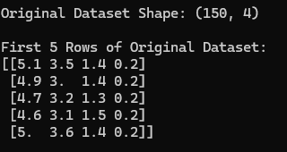
* #### **Mean vector.**
    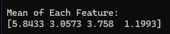
* #### **Centered data sample.**
    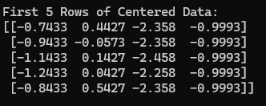
* #### **Covariance matrix.**
    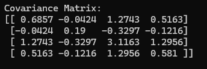

<div style="page-break-after: always;"></div>

* #### **Eigenvalues.**
    
* #### **Eigenvectors.**
    
* #### **Singular values.**
    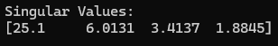
* #### **`V^T` matrix.**
    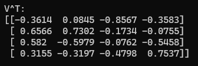
* #### **`S` matrix.**
    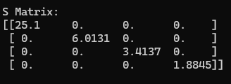

<div style="page-break-after: always;"></div>

* #### **Sample rows of `U`.**
    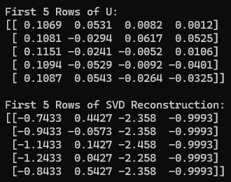
* #### **SVD reconstruction error.**
    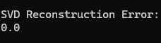
* #### **Explained variance ratio.**
    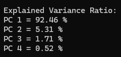
* #### **First two principal components.**
    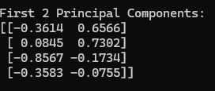

<div style="page-break-after: always;"></div>

* #### **Reduced dataset shape and sample rows.**
    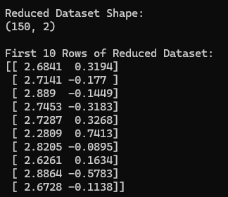
* #### **Reconstructed data sample.**
    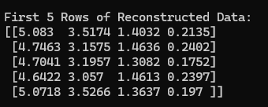
* #### **Reconstruction error.**
    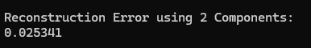
* #### **Reconstruction errors for different values of `k`.**
    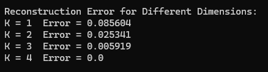

<div style="page-break-after: always;"></div>

* #### **PCA scatter plot.**
    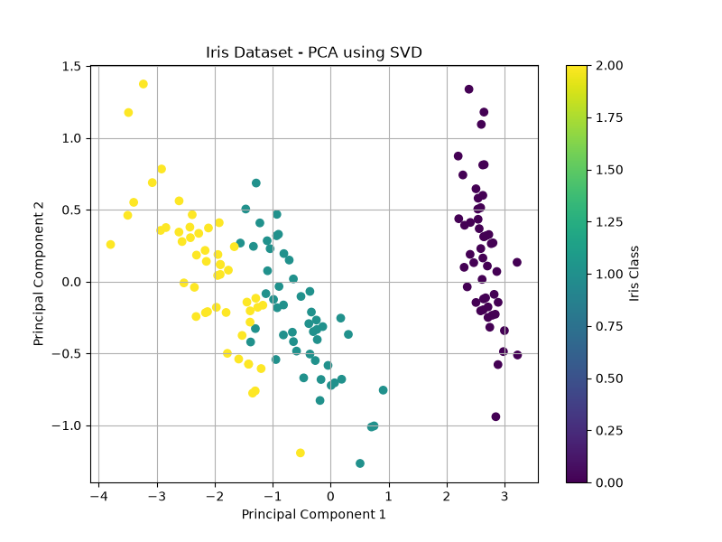

<div style="page-break-after: always;"></div>

# Learning Outcomes


After completing this project, the following concepts were understood
and implemented:

-   Principal Component Analysis.
-   Singular Value Decomposition.
-   Mean centering.
-   Covariance matrix.
-   Eigenvalues and eigenvectors.
-   Singular values.
-   Principal components.
-   Explained variance.
-   Dimensionality reduction.
-   Data reconstruction.
-   Reconstruction error.
-   Visualization of reduced data.
-   Generalized numerical programming.


# Conclusion


The project successfully implements **Principal Component Analysis using
Singular Value Decomposition** in Python using the Iris dataset.

The program performs the mathematical steps required for PCA, starting
from mean centering and covariance calculation and continuing through
eigenvalue/eigenvector calculation, SVD construction, dimensionality
reduction, reconstruction, and error calculation.

The Iris dataset is reduced from four dimensions to two principal
components. The first two components retain approximately **97.77% of
the total variance**, demonstrating how PCA can reduce dimensionality
while preserving most of the variation in the data.

The project provides practical understanding of how PCA and SVD can be
implemented computationally and how dimensionality reduction can be
evaluated using explained variance and reconstruction error.
